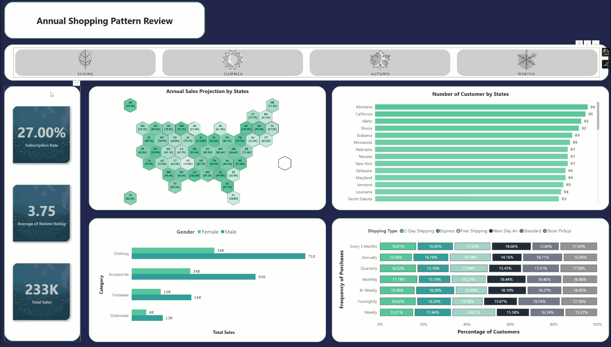
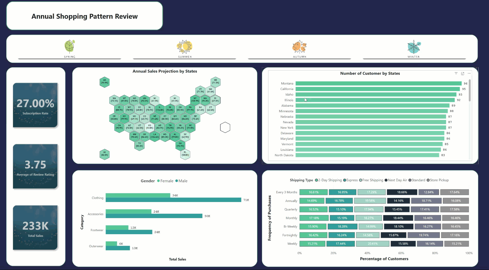

<div align="center">
  <h1>Customer Shopping Pattern Analysis Dashboard</h1>
</div>


![Visual Studio Code](https://img.shields.io/badge/Visual%20Studio%20Code-0000B9.svg?style=for-the-badge&logo=data:image/png;base64,iVBORw0KGgoAAAANSUhEUgAAADAAAAAwCAYAAABXAvmHAAAACXBIWXMAAAsTAAALEwEAmpwYAAADv0lEQVR4nO2ZvWsUQRjGZ97VJogfaSSFQbC5bWyUYGMRsbWwsBObgIWFMWBmLid4gtGZBNTOzn9ABEHZGMzsLRo/Ck935hRUSBELQQIKIrkLEjMyG8479T5mde8L7oEpd+f57b4z88wMQn311VfH5FBxDKhY2sZfPXMfFA+jXhIQMQbUXwfqayctNty5ona94suUVzyFshpQNwuoGAcqNoz5cosAKu21ATmQ11tRd0ljTMRstXGoDRC11Nzqsuutjh+4pwc67RyhbLAFE3GrlnmoA/CrecWV1NzqBNIad8j8vQFMhFfPPDQDqIBk2m8+vbgLiHjSyDzYA3xsr/nMoyGgvmpmHmwB5oq6febP+/vMHG9jHloCYAYMD0cQC/fGNj8ZHAQiVmzNQ+IA194MYq4C4EoDU+uYyWl0+7Zj86gzKUaB+F/jmIdEAfibYeDybWS+qhkgNJ0famieiuNARCmWeSJKkM6dTgwAuFr803ylyU8Ok0dqPjeZOwPE/xHvy4t36LzYb55PDoDJz/UBNksKmLxYnVcgLWjcksFE3EF0YUf5HYkBYC4vNwQolxSTD9GVwm5MxPWY5tdMFvqzXzexMaA1xkxdsoEAJktwYTFOySwjIkZqdesmPY0Cl2eByx/NIZSG7HMNNNe4ZKh/F40HO+v157ZiIQMWngSmvlv9jct5Demg1lf/bsZIs77cVq3EDiscBS6/WUFcDTVkHlUDfEAkOGTTj9vSKMHDEeDyixWEadnnGhP/PpqYH7Ttwm0pABEjkAm+RF/YEgKz8L5Z0TsO4KQXjgIR36KSyAQarryyhgAuPyCuOldCQMXJaBBWD8opA5G3hzCTACu0fxADyZ2tGw3Suc1Zx/pPRAvfXXQjbMc0qjGm/qXmi5KBeFGKAwFMLUcRvZUAmPrTVlmG+g/RlNiNubweD0KuAVOtixJA/c9NzK8DFRdRNlsJc6xAY0FsxvM7iOeTD3NA/cf1s7v/yaF+7Tg9o85YRY/f/8Y7NFtINk4jujAMRLz9O/76gdmkN3rUYeFx4DLeuOCyBKyQ3IYm0sT8oDFcLhkzLtAJyy3lTDgKXH2NW1Ju8uuAxmZzji7M70FxNVM4CFytdBjgPzX7eh8wudS7AEbT+SFgUvUugBEr7AKuniQC4LX7aLGsbH4Ac+n9L0DKK051BiCCCLZgrm79E4AXHa+f69zxevWBAZeztgCprrrgqJLJQsDkRgOAbr1iqgi4HIsOybjSDpe9dclXlsPkMeDq/fabS0977pq1r75Qd+gnbk39qO0MuGMAAAAASUVORK5CYII=&logoColor=white)


---

### Table of Contents
- [📖 Background](#-background)
- [💡 Business Question](#-business-question)
- [📊 Data Overview](#-data-overview)
- [🧹 Data Preparation](#-data-preparation)
- [🔍 Analysis](#-analysis)
- [📝 Conclusion](#-conclusion)
- [🚀 Getting Started](#-getting-started)
- [📄 License](#-license)

---

## 📖 Background

Understanding customer shopping patterns is crucial for making informed business and marketing decisions. We are social animals influenced by their surroundings. The shopping pattern of a customer is affected by various factors such as demographics, preferences, and behavior. Analyzing these patterns can help businesses identify trends and opportunities to improve their strategies and customer service.

---

## 💡 Business Question

The business question is to analyze customer shopping patterns and uncover key trends and insights to guide improvements in marketing strategies and service quality.

---

## 📊 Data Overview

The dataset consists of detailed transactional data across various product categories, customer demographics, and purchase channels. Key features include:

- <b>Transaction Details</b>: Purchase date, transaction value, product category, and payment method.
- <b>Customer Information</b>: Age group, gender, location, and loyalty status.
- <b>Shopping Behavior</b>: Frequency of purchases, average spend per transaction, and seasonal trends.

---

## 🧹 Data Preparation

- <b>Data Loading</b>: Import the dataset into Power BI using a Python script.
- <b>Data Cleaning</b>: Ensure consistency by converting necessary data types.
- <b>Data Formatting</b>: Standardize formats for accuracy in analysis.

---

## 🔍 Analysis

The visualization is designed to provide a dual perspective:
- <b>Overview</b>: A high-level summary of key metrics.
- <b>Regional Insights</b>: A detailed breakdown of customer behavior by region.

It incorporates temporal trends to help identify seasonal patterns and optimize strategies.

| Title                        | Description                                                         |
|------------------------------|---------------------------------------------------------------------|
| **Overview**                 |     |
| **Detailed State Sales**     |     |

| Metric                        | Description                       |
|-------------------------------|-----------------------------------|
| **Total Sales Amount**        | Total revenue generated           |
| **Average Transaction Value** | Mean spend per transaction        |
| **Total Number of Customers** | Total distinct customers          |
| **Customer Satisfaction**     | Overall satisfaction score        |

---

## 📝 Conclusion

Constrained by the available data, this visualization provides a snapshot of customer shopping patterns and business performance. These insights serve as a starting point for deeper exploration and decision-making:

| Visualization                   | Business Questions                                                                                             |
|---------------------------------|---------------------------------------------------------------------------------------------------------------|
| **Subscription Rate**           | What customer demographics are most likely to subscribe? <br>How does average spend compare between groups?    |
| **Sales by Region**             | What revenue potential exists with increased subscription rates? <br>How can market positioning be optimized?    |
| **Popular Products**            | Which products are favored by customers? <br>Is there a link between promotional strategies and purchase behavior?|
| **Shopping Frequency & Shipping**| How does frequency relate to preferred shipping methods? <br>What improvements can optimize revenue?             |

---

## 🚀 Getting Started

To work on this project locally, clone the repository by running:

```bash
git clone https://github.com/gary3456/Customer-Shopping-Viz.git
```

Then, navigate to the project folder (the repository's name will be used as the folder):

```bash
cd Customer-Shopping-Viz
```

Feel free to submit pull requests with improvements.

---

## 📄 License

This project is licensed under the Batch License.


